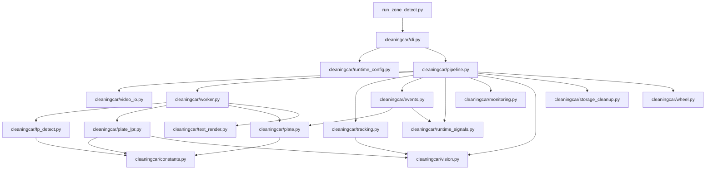

# cleaningcar 模块说明

`cleaningcar/` 是项目主运行包，负责把视频输入、RKNN 推理、车牌识别、跟踪、事件、截图、运行信号和守护协作起来。

## 模块职责

- `constants.py`
  - 定义类别列表、类别阈值、车牌字符表、颜色常量和业务映射
  - 当前项目内统一以这里的车牌字符定义为准

- `runtime_config.py`
  - 读取配置并生成运行时配置
  - 将 CLI 覆盖项与默认值合并

- `video_io.py`
  - 打开视频源
  - 管理 RTSP / 文件输入
  - RTSP 只使用 `GStreamer+mpp direct-BGR`，打开失败即读流失败；离线文件可保留非 RGA 硬解链路。单车视频仅使用 `FFmpeg` 硬编，写视频没有软件编码兜底
  - 负责运行时路径解析

- `vision.py`
  - 提供 IoU、点位缩放、anchor 计算等几何工具

- `fp_detect.py`
  - 负责 FP 检测模型后处理
  - 支持 `6` 输出模式和 `9` 输出模式切换

- `plate_lpr.py`
  - 双模型车牌识别主链路
  - 包含车牌检测、透视矫正、字符解码、颜色解码

- `plate.py`
  - 车牌文本规范化
  - 合法性校验
  - 车牌锁定辅助
  - 不负责旧 `lpr.rknn` 单模型推理

- `text_render.py`
  - 统一中文文本渲染层
  - 优先使用 `fonts/platech.ttf`
  - 无项目字体时按固定系统字体顺序兜底

- `tracking.py`
  - 负责车辆目标跟踪

- `events.py`
  - 负责事件状态机、事件 JSON、事件截图和事件上报
  - `type=5` 会附加 `wheelResults`
  - 只使用单车生命周期内已锁定的左右轮结果；未锁到则不附加
  - 事件截图只有真实落盘成功才写入 `captureImage`
  - 当前默认优先保存原图事件截图，而不是调试叠加图

- `anchor.py`
  - 统一计算正式方向感知锚点D、中性运动点H和旧兼容锚点L
  - D正式参与Zone判断，L仅用于调试对照和紧急回退
  - 识别画面边缘截断框，并在存在可靠历史时使用运动预测稳定候选锚点
  - 方向只根据H的多帧轨迹判定；G暂时停用，仅保留trace兼容字段

- `event_trace.py`
  - 默认关闭的事件层输入追踪
  - 异步记录检测/跟踪输入、保留ID、丢帧、Zone变化、事件输出和时序异常
  - 按配置和运行批次生成 `run.json`、`frames.jsonl`、`events.jsonl`、`summary.json`
  - 不保存图片内容，并对RTSP源移除用户名和密码

- `runtime_signals.py`
  - 输出心跳文件、启动标志、启动截图、手动截图

- `storage_cleanup.py`
  - 保留的旧清理模块
  - 当前运行期默认禁用
  - 后续如需恢复，应单独评审回收策略和误删风险

- `monitoring.py`
  - 输出 CPU、内存、温度等运行监控信息

- `worker.py`
  - 每个 RKNN worker 线程负责：
    - 检测模型推理
    - 检测后处理
    - 双模型车牌识别
    - 基础叠框与叠字
    - 车牌框仅在 `logic.draw_plate_boxes=true` 且未启用 `logic.no_draw` 时绘制

- `wheel.py`
  - 左右车轮 RTSP 旁路检测
  - 低队列、丢旧帧；事件驱动时无 Zone A 活跃轨迹只拉流不推理，活跃后按 `wheel.active_target_fps` 控制，`0` 表示不额外节流
  - 单帧内优先选离画面中心最近的有效轮胎框
  - 生命周期内按“更居中 -> 更高分 -> 更晚命中”持续更新单车锁定轮胎结果
  - 同侧短时间连续命中的轮胎结果会整串归属给同一辆车，避免同一波结果拆给后车
  - 正式上传的车轮图片使用原图，不带调试标注

- `pipeline.py`
  - 主流程总调度层
  - 负责把读流、worker、跟踪、事件、截图、命令处理、车轮旁路和单车视频串起来
  - 当前只保留 per-id 单车视频，不再维护全局视频保存链路
  - 调试帧会单独从原始帧复制并绘制，不和事件截图共用一张图

- `cli.py`
  - 命令行入口
  - 把配置和参数组装后交给 `pipeline.py`

## 主调用关系

1. `run_zone_detect.py`
2. `cleaningcar/cli.py`
3. `cleaningcar/pipeline.py`
4. `cleaningcar/worker.py`
5. `cleaningcar/fp_detect.py` + `cleaningcar/plate_lpr.py`
6. `cleaningcar/tracking.py` + `cleaningcar/events.py`
7. `cleaningcar/runtime_signals.py` + `cleaningcar/storage_cleanup.py`

## 主链路依赖图

说明：

- `pipeline.py` 是主调度中心，负责把读流、推理、跟踪、事件和运行信号串起来
- `worker.py` 是检测与双模型车牌识别的执行层
- `plate_lpr.py` 负责双模型车牌推理，`plate.py` 只负责文本后处理和锁定
- `runtime_signals.py` 独立负责心跳、启动标志、启动截图和手动截图
- `storage_cleanup.py` 保留为旧能力占位，当前默认禁用，不作为现行主链路能力

## 当前模块级改动收口

- 车牌字符表统一到了 `constants.py`
- 车牌候选的序列部分必须至少包含一个数字；省份简称后全为字母的明显误识别不会进入锁定或上报
- 中文显示新增 `text_render.py`
- 事件截图真实落盘校验收到了 `events.py`
- 运行期清理已收口为默认禁用，仅保留 `storage_cleanup.py` 旧实现
- RTSP 读流已收口为 GStreamer direct-BGR 唯一路径，不回退到 FFmpeg 或 safe 管线；离线文件仍可使用非 RGA 硬解。单车视频只使用 FFmpeg 硬编，不使用 GStreamer 写出或软件链路兜底
- 全局视频保存残留已删除，仅保留 `logic.enable_per_id_video`
- 单车录像帧源由 `logic.per_id_video_source` 统一控制：`annotated` 保存完整调试画面，`raw` 保存干净原始画面，`auto` 默认按 `raw` 处理
- Web 不再浏览 per-id 单车录像，但 `pipeline.py` 仍保存单车录像文件
- 实时调试图与事件截图已分流：调试图带绘制，事件截图默认优先原图
- 当前主链路只保留双模型车牌流程，旧单模型 LPR 仅保留在 `future_modules/legacy_lpr/`

## 建议阅读顺序

1. `cli.py`
2. `pipeline.py`
3. `worker.py`
4. `fp_detect.py`
5. `plate_lpr.py`
6. `plate.py`
7. `events.py`
8. `runtime_signals.py`
9. `storage_cleanup.py`
10. `text_render.py`
